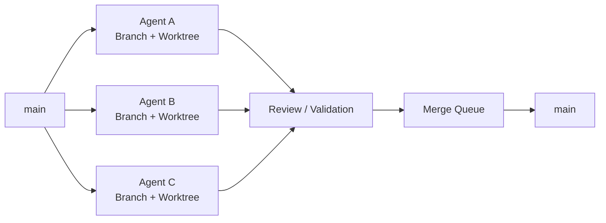
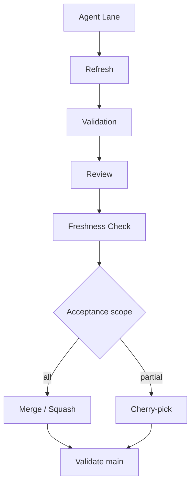
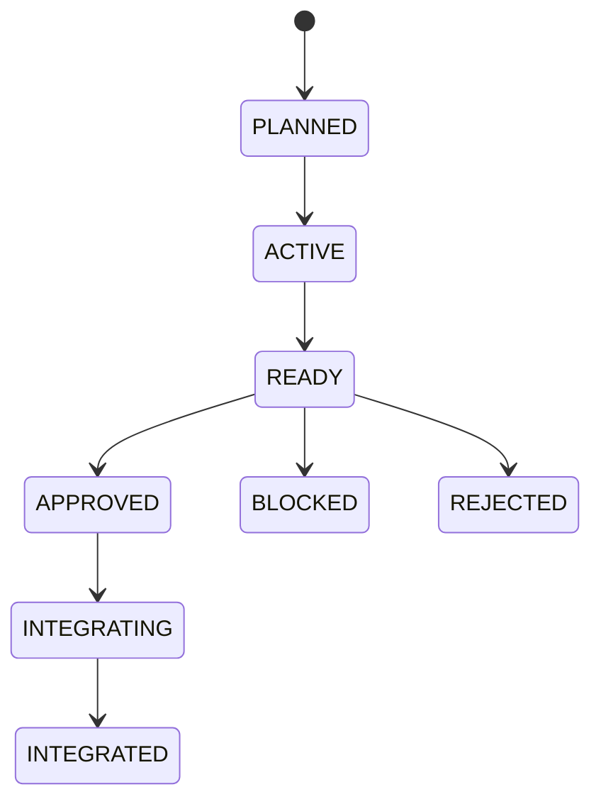

# Multi-Agent Git Orchestrator Skills

[English](README.en.md) | [中文](README.md)

> **Let multiple AI agents safely develop the same Git repository in parallel.**

A Git workflow skill for coding agents — Claude Code, Codex, Cursor, OpenCode, Hermes, and any host that supports the Agent Skills format.

It actively inspects the current repository's **branch / worktree / commit / ahead-behind / dependency** state, then helps the agent decide:

- Which tasks can safely run in parallel
- Which worktrees can be reused or reclaimed
- Which branches should be rebased vs merged
- Which commits are worth cherry-picking
- Which branches are now safe to delete
- How to stop several agents from destroying `main`


---

## Why

Multi-agent development usually collapses into this:

```text
Agent A ─┐
Agent B ─┼── one shared directory ── conflicts / overwrites / tangled history
Agent C ─┘
```

This skill turns it into this:



The core principle:

> **One Agent Lane = One Branch + One Worktree**

---

## Capabilities

| Capability | What it does |
|---|---|
| Repository Recon | Actively inspects branches, worktrees, HEAD, dirty state, ahead/behind |
| Dependency DAG | Works out which agent tasks block which |
| Worktree Isolation | Stops multiple agents from mutating the same checkout |
| Rewrite Safety | Decides when a rebase is allowed and when history is frozen |
| Selective Integration | Picks merge / squash / cherry-pick based on actual state |
| Freshness Gate | Blocks integration when `main` moved after your review |
| Merge Queue | Serializes writes into the shared integration branch |
| Safe Cleanup | Identifies completed branches and worktrees safely |
| Safe Rollback | `reset` for private history, `revert` for shared history |

---

## The six commands

### `GitRecon` — read the room

```text
/GitRecon
```

Surveys worktrees, branches, HEAD, dirty/untracked files, ahead/behind, detached HEADs, remote tracking, merge candidates, and risk. **Read-only by default.**

### `GitAnalyze <target>` — understand one lane

```text
/GitAnalyze agent/auth
```

```text
agent/auth

Ahead:     3
Behind:    2
State:     DIVERGED
Depends:   agent/core
Rewrite:   FROZEN

Recommendation:
Do not rebase directly.
Sync the integration branch, then re-validate.
```

### `GitRecommend [goal]` — decide what happens next

```text
/GitRecommend how should I schedule 3 agents
```

It investigates first, then answers:

```text
Agent A → safe to continue in parallel
Agent B → heavy file overlap with A, run serially
Agent C → depends on A, wait

agent/old-ui → cleanup candidate
agent/auth   → rewrite frozen
```

### `GitIntegrate <lane>` — land the work behind a gate

```text
/GitIntegrate agent/auth
```



An agent saying **"Done"** does not get it into `main`.

### `GitCleanup` — reclaim branches safely

```text
/GitCleanup            # preview only
/GitCleanup --apply    # actually delete
```

A branch is only a cleanup candidate when **all** of these hold:

```text
✓ fully integrated
✓ worktree clean
✓ no active owner
✓ no downstream dependents
✓ no unique unsaved work
```

### `GitConverge <branch>` — fold every lane into one branch

```text
/GitConverge agent/release            # preview the plan only
/GitConverge agent/release --apply    # merge, then delete merged branches
```

Merges every local branch's unique commits into `<branch>` (`main` first, then the largest sources), then deletes the merged
local branches and their clean worktrees, so only `main` and `<branch>` remain. The preview shows the merge order, each
source's status, the blockers, and the final branch list; `--apply` runs exactly the plan it prints.

```text
✓ main is a merge source only: never moved, reset, or deleted
✓ a conflict aborts that merge, stops the run, and deletes nothing
✓ remote branches, tags, and detached worktrees are never touched
✓ dirty, locked, in-progress, or agent-owned worktrees keep their branch
✓ ignored files (.env) are never overwritten; worktrees holding them stay unless --discard-ignored
✓ never branch -D, worktree remove --force, or a repository-wide worktree prune
```

---

## Agent lane lifecycle



Every lane tracks: task, owner, branch, worktree, base branch, base SHA, current HEAD, dependencies, validation evidence, integration decision.

---

## Git decision rules

```text
whole agent result needed
        ↓
      Merge

only some commits needed
        ↓
   Cherry-pick

agent's private branch fell behind main
        ↓
  Rewrite-safe?
    ↓       ↓
   YES      NO
 Rebase    Merge target into lane

private history went wrong
        ↓
      Reset

error already in shared history
        ↓
      Revert
```

---

## Safety principles

```text
Observe first.
Advise second.
Mutate only when needed.
```

Denied by default:

- Multiple agents mutating the same checkout
- Concrete branch/worktree advice without inspecting the repository first
- Rebasing a branch other agents depend on
- Destructive reset on shared history
- Force push by default
- Cherry-picking without a dependency check
- Continuing integration after review has gone stale
- Deleting a branch just because it is old

---

## Install

Copy the directory into your agent's skills path:

```text
multi-agent-git-orchestrator/
├── SKILL.md              # root skill — triggers semantically
├── commands/             # Claude Code slash commands
├── skills/               # Codex / Hermes command adapters
└── references/
    ├── commands.md
    ├── reconnaissance.md
    ├── decision-matrix.md
    ├── handoff-and-state.md
    ├── design-rationale.md
    └── pressure-tests.md
```

The root skill triggers on its own through semantic matching. The six commands are optional explicit entry points.

### Cross-host install (recommended)

```bash
python -X utf8 scripts/sync_hosts.py --host codex --host hermes --apply --create-roots
python -X utf8 scripts/sync_hosts.py --host codex --host hermes --verify
```

`--verify` checks that every file the adapters reference actually exists, without starting an AI host. The script never deletes files.

### Claude Code

```bash
mkdir -p ~/.claude/commands && cp commands/Git*.md ~/.claude/commands/
```

```powershell
New-Item -ItemType Directory -Force "$HOME\.claude\commands"; Copy-Item commands\Git*.md "$HOME\.claude\commands\"
```

Or just drop the skill into `~/.claude/skills/`. Start a new session, then type `/Git`.

### Codex

```bash
python -X utf8 scripts/sync_hosts.py --host codex --apply --create-roots
```

```powershell
$codexPackage = Join-Path $HOME ".agents\skills\MAGOS"
New-Item -ItemType Directory -Force $codexPackage | Out-Null
Copy-Item -Path .\SKILL.md, .\references, .\skills -Destination $codexPackage -Recurse -Force
```

Restart Codex, press `$` to pick a command skill, or call `$git-recon`, `$git-analyze`, `$git-recommend`, `$git-integrate`, `$git-cleanup`, `$git-converge` directly. `/skills` opens the skill browser. Arguments go after the skill name, e.g. `$git-analyze agent/auth --remote`; `--help` prints full usage.

> Codex's `/` menu only contains built-in commands, so custom `/git-*` slash commands cannot be registered. The skill selector (`$` / `/skills`) is the entry point on Codex.

### Hermes

```bash
python -X utf8 scripts/sync_hosts.py --host hermes --apply --create-roots
```

```bash
mkdir -p "${HERMES_HOME:-$HOME/.hermes}/skills/multi-agent-git-orchestrator"
cp -R SKILL.md references skills "${HERMES_HOME:-$HOME/.hermes}/skills/multi-agent-git-orchestrator/"
```

Restart Hermes, then `hermes skills list`, then `/git-recon`, `/git-analyze`, `/git-recommend`, `/git-integrate`, `/git-cleanup`, `/git-converge`. Hermes has no per-skill auto-invoke switch, so the adapter layer specifies that `/git-integrate`, `/git-cleanup`, and `/git-converge` never write to the repository unless you invoke them explicitly.

### Hosts without custom slash commands

Just type the command name:

```text
GitRecon
GitAnalyze agent/auth
GitRecommend
```

---

## Command matrix

| Command | Claude Code | Hermes | Codex | Purpose |
|---|---|---|---|---|
| GitRecon | `/GitRecon` | `/git-recon` | `$git-recon` | Inspect branch/worktree state, produce a snapshot |
| GitAnalyze | `/GitAnalyze` | `/git-analyze` | `$git-analyze` | Analyze diffs, dependencies, and rewrite risk for a target |
| GitRecommend | `/GitRecommend` | `/git-recommend` | `$git-recommend` | Recommend the next Git/multi-agent move from real state |
| GitIntegrate | `/GitIntegrate` | `/git-integrate` | `$git-integrate` | Integrate a lane through safety gates |
| GitCleanup | `/GitCleanup` | `/git-cleanup` | `$git-cleanup` | Preview cleanups; `--apply` required to delete |
| GitConverge | `/GitConverge` | `/git-converge` | `$git-converge` | Merge every local branch into one and keep only `main` and it; preview by default, `--apply` to run |

```bash
python -X utf8 tests/codex/contracts/run_contract_cases.py
```

Runs the source contract checks. Inputs and expected results live in `tests/codex/contracts/cases/<group>/<case>/evidence/`. No AI host is started. The `package/install-layout` case installs the Codex and Hermes packages into a temporary home and confirms every file the adapters reference exists, and that each skill is discovered exactly once under each host's discovery rules.

---

## Who it's for

- Multi-agent development in Claude Code / Codex / Cursor
- Parallel development across git worktrees
- AI-assisted task decomposition
- Managing a large number of agent branches
- Human-in-the-loop review
- Agent worktree visualization
- Automated merge queues
- Selective integration of AI-generated code

---

## Philosophy

Git is not only version control. In multi-agent software engineering it also becomes:

```text
Isolation Layer
+
Dependency Graph
+
Review Boundary
+
Integration Protocol
+
Rollback System
```

**Let agents develop boldly. Keep the main branch under control.**

---

## License

Apache-2.0
