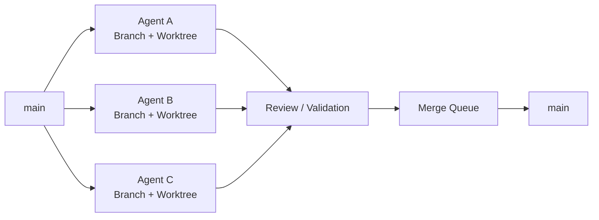
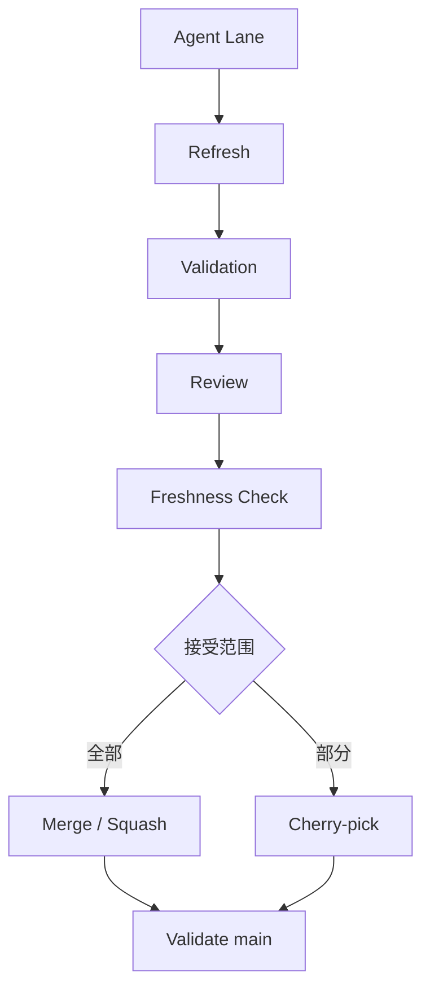
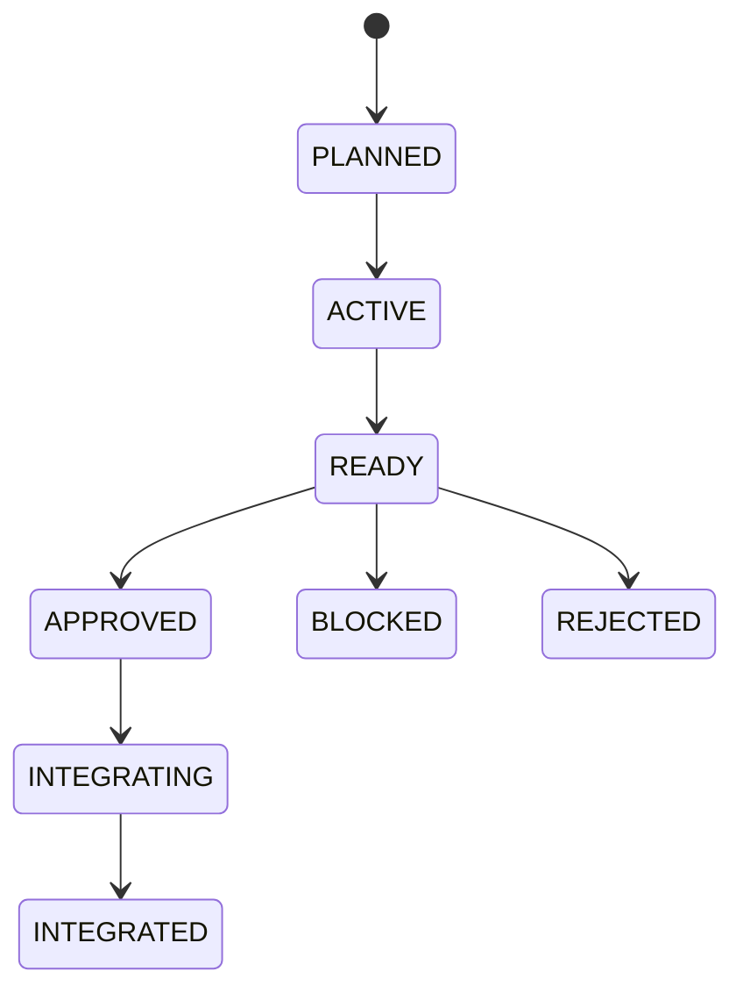

# Multi-Agent Git Orchestrator Skills

> **让多个 AI Agent 安全地并行开发同一个 Git 仓库。**

`Multi-Agent Git Orchestrator` 是一个面向 Claude Code、Codex、Cursor、OpenCode 等 Coding Agent 的 Git Workflow Skill。

它会主动调查当前仓库的 **Branch / Worktree / Commit / Ahead-Behind / Dependency** 状态，并帮助 Agent 决定：

- 哪些任务可以并行
- 哪些 Worktree 可以复用
- 哪些 Branch 应该 Rebase / Merge
- 哪些 Commit 适合 Cherry-pick
- 哪些分支已经可以安全清理
- 如何避免多个 Agent 同时破坏 `main`


---

## Why?

多 Agent 开发很容易变成：

```text
Agent A ─┐
Agent B ─┼── 同一个目录 ── 冲突 / 覆盖 / 历史混乱
Agent C ─┘
```

本 Skill 将其变成：



核心原则：

> **One Agent Lane = One Branch + One Worktree**

---

## 核心能力

| 能力 | 说明 |
|---|---|
| Repository Recon | 主动调查 Branch / Worktree / HEAD / Dirty / Ahead-Behind |
| Dependency DAG | 判断 Agent 任务之间的依赖关系 |
| Worktree Isolation | 避免多个 Agent 修改同一个 Checkout |
| Rewrite Safety | 判断什么时候可以 Rebase，什么时候禁止重写历史 |
| Selective Integration | Merge / Squash / Cherry-pick 按实际情况选择 |
| Freshness Gate | 防止 Review 后 `main` 已变化却继续错误集成 |
| Merge Queue | 串行写入共享集成分支 |
| Safe Cleanup | 安全识别已完成 Branch / Worktree |
| Safe Rollback | 私有历史用 Reset，共享历史优先 Revert |

---

## 五个核心命令

### `/GitRecon`

查看整个仓库当前状态。

```text
/GitRecon
```

调查：

```text
Worktrees
Branches
HEAD
Dirty / Untracked
Ahead / Behind
Detached
Remote tracking
Merge candidates
Risk
```

默认 **只读**。

---

### `/GitAnalyze`

深入分析指定 Branch 或 Worktree。

```text
/GitAnalyze agent/auth
```

例如判断：

```text
agent/auth

Ahead:     3
Behind:    2
State:     DIVERGED
Depends:   agent/core
Rewrite:   FROZEN

Recommendation:
不要直接 rebase
建议同步 integration branch 后重新验证
```

---

### `/GitRecommend`

根据仓库真实状态给出下一步建议。

```text
/GitRecommend 下一步怎么安排 3 个 Agent
```

Agent 会先调查，再回答：

```text
Agent A → 可以继续并行
Agent B → 与 A 文件高度重叠，建议串行
Agent C → 依赖 A，等待 A 完成

agent/old-ui → cleanup candidate
agent/auth   → rewrite frozen
```

---

### `/GitIntegrate`

安全集成一个 Agent 的成果。

```text
/GitIntegrate agent/auth
```

流程：



不会因为 Agent 说一句 **“Done”** 就直接进入 `main`。

---

### `/GitCleanup`

寻找可安全清理的 Branch / Worktree。

```text
/GitCleanup
```

默认只显示：

```text
Cleanup Candidates
```

真正执行：

```text
/GitCleanup --apply
```

只有满足以下条件才允许进入清理候选：

```text
✓ 已完整集成
✓ Worktree clean
✓ 无活动 Owner
✓ 无下游依赖
✓ 无独有未保存成果
```

---

## 多 Agent 生命周期



每条 Agent Lane 都记录：

```text
Task
Owner
Branch
Worktree
Base Branch
Base SHA
Current HEAD
Dependencies
Validation Evidence
Integration Decision
```

---

## Git 操作决策

```text
整个 Agent 成果都要
        ↓
      Merge

只要部分 Commit
        ↓
   Cherry-pick

Agent 私有分支落后 main
        ↓
  Rewrite-safe?
    ↓       ↓
   YES      NO
 Rebase    Merge target into lane

私有历史走错
        ↓
      Reset

已经进入共享历史后出错
        ↓
      Revert
```

---

## 安全原则

```text
Observe first.
Advise second.
Mutate only when needed.
```

本 Skill 默认禁止：

- 多个 Agent 同时修改同一个 Checkout
- 未调查仓库就给出具体 Branch / Worktree 建议
- 随意 Rebase 已被其他 Agent 依赖的 Branch
- 对共享历史执行 destructive reset
- 默认 Force Push
- 未检查依赖就 Cherry-pick
- Review 已过期仍然继续 Integration
- 仅因为 Branch 很旧就判断可以删除

---

## 安装

将目录放入支持 Agent Skills 的 Skills 路径：

```text
multi-agent-git-orchestrator/
├── SKILL.md
├── commands/                  # Claude Code command prompts
├── skills/                    # Codex / Hermes command adapters
└── references/
    ├── commands.md
    ├── reconnaissance.md
    ├── decision-matrix.md
    ├── handoff-and-state.md
    ├── design-rationale.md
    └── pressure-tests.md
```

Skill 可以通过语义自动触发。

### Claude Code：启用 Slash Command

Claude Code 只会为每个 Skill 注册**一个**以 Skill 名命名的斜杠命令，`/GitRecon` 等五个命令需要额外安装 `commands/` 下的命令文件：

```text
commands/
├── GitRecon.md
├── GitAnalyze.md
├── GitRecommend.md
├── GitIntegrate.md
└── GitCleanup.md
```

在本仓库根目录执行，复制到用户级命令目录（所有项目可用）；也可以复制到某个项目的 `.claude/commands/`（仅该项目可用）。注意不要放进 Skill 目录内部，那里的文件不会被识别为命令：

```bash
mkdir -p ~/.claude/commands && cp commands/Git*.md ~/.claude/commands/
```

```powershell
New-Item -ItemType Directory -Force "$HOME\.claude\commands"; Copy-Item commands\Git*.md "$HOME\.claude\commands\"
```

安装后**重新开启会话**，输入 `/Git` 即可看到五个命令。

也可以显式调用：

```text
/GitRecon
/GitAnalyze <branch>
/GitRecommend [goal]
/GitIntegrate <lane-or-branch>
/GitCleanup
```

五个命令的跨宿主名称和说明：

| 命令 | Claude Code | Hermes | Codex | 说明 |
|---|---|---|---|---|
| GitRecon | `/GitRecon` | `/git-recon` | `$git-recon` | 检查仓库 branch / worktree 状态并生成快照 |
| GitAnalyze | `/GitAnalyze` | `/git-analyze` | `$git-analyze` | 分析指定目标的差异、依赖和操作风险 |
| GitRecommend | `/GitRecommend` | `/git-recommend` | `$git-recommend` | 根据当前状态建议 Git 与多 Agent 下一步 |
| GitIntegrate | `/GitIntegrate` | `/git-integrate` | `$git-integrate` | 通过安全门禁后集成指定 lane 或 branch |
| GitCleanup | `/GitCleanup` | `/git-cleanup` | `$git-cleanup` | 默认预览可清理项；`--apply` 才允许删除 |

### Codex：启用命令 Skill

Codex 的自定义入口是 Skill 选择器（`$`），不是任意命名的 `/Git...` Slash Command。仓库的 `skills/` 为每个命令提供一个独立 Skill，`agents/openai.yaml` 中的简短说明会显示在 Codex 的 Skill 列表里。

将仓库内容放在用户级 Codex skills 目录下的 `MAGOS` 子目录中。Windows PowerShell：

```powershell
$codexHome = if ($env:CODEX_HOME) { $env:CODEX_HOME } else { Join-Path $HOME ".codex" }
$codexPackage = Join-Path $codexHome "skills\MAGOS"
New-Item -ItemType Directory -Force $codexPackage | Out-Null
Copy-Item -Path .\SKILL.md, .\commands, .\references, .\skills -Destination $codexPackage -Recurse -Force
```

macOS / Linux：

```bash
mkdir -p "${CODEX_HOME:-$HOME/.codex}/skills/MAGOS"
cp -R SKILL.md commands references skills "${CODEX_HOME:-$HOME/.codex}/skills/MAGOS/"
```

重新启动 Codex 后，输入 `$` 选择命令 Skill，或直接调用 `$git-recon`、`$git-analyze`、`$git-recommend`、`$git-integrate`、`$git-cleanup`。`/skills` 可打开 Skill 浏览入口。每个命令在列表中都带有简短说明。

### Hermes：启用 Slash Skill

Hermes 会把已安装的每个 Skill 自动注册成一个 Slash Command，并将 `SKILL.md` 的 `description` 用作命令说明。Windows PowerShell：

```powershell
$hermesSkills = Join-Path $HOME ".hermes\skills\multi-agent-git-orchestrator"
New-Item -ItemType Directory -Force $hermesSkills | Out-Null
Copy-Item -Path .\SKILL.md, .\commands, .\references, .\skills -Destination $hermesSkills -Recurse -Force
```

macOS / Linux：

```bash
mkdir -p "$HOME/.hermes/skills/multi-agent-git-orchestrator"
cp -R SKILL.md commands references skills "$HOME/.hermes/skills/multi-agent-git-orchestrator/"
```

重新启动 Hermes 后，可运行 `hermes skills list` 查看各命令说明，并调用 `/git-recon`、`/git-analyze`、`/git-recommend`、`/git-integrate` 或 `/git-cleanup`。参数直接跟在命令后面，例如 `/git-analyze main --remote`。

如果宿主不支持自定义 Slash Command，也可以直接输入：

```text
GitRecon
GitAnalyze agent/auth
GitRecommend
```

---

## 适用场景

特别适合：

- Claude Code / Codex / Cursor 多 Agent 开发
- Git Worktree 并行开发
- AI 自动任务拆分
- 大量 Agent Branch 管理
- Human-in-the-loop Review
- Agent Worktree 可视化
- 自动 Merge Queue
- AI 生成代码的选择性集成

---

## Philosophy

Git 不只是版本管理工具。

在多 Agent 软件工程中，它还可以成为：

```text
Isolation Layer
+
Dependency Graph
+
Review Boundary
+
Integration Protocol
+
Rollback System
```

**让 Agent 可以大胆开发，让主分支保持可控。**

---

## License

Apache-2.0
